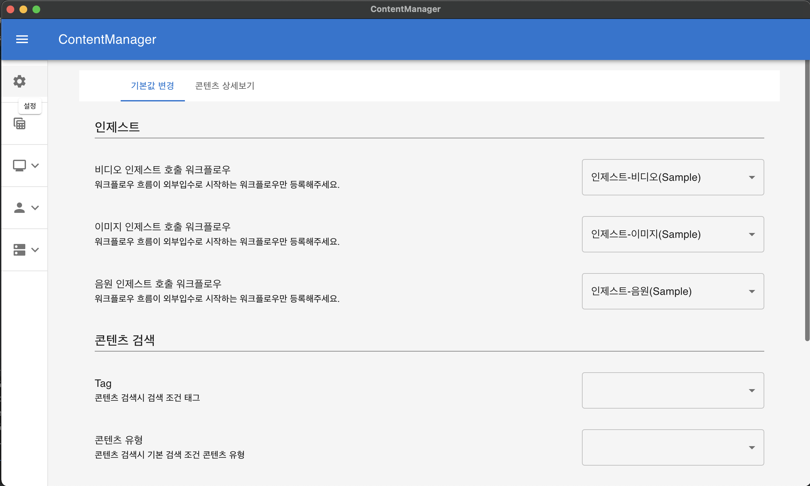
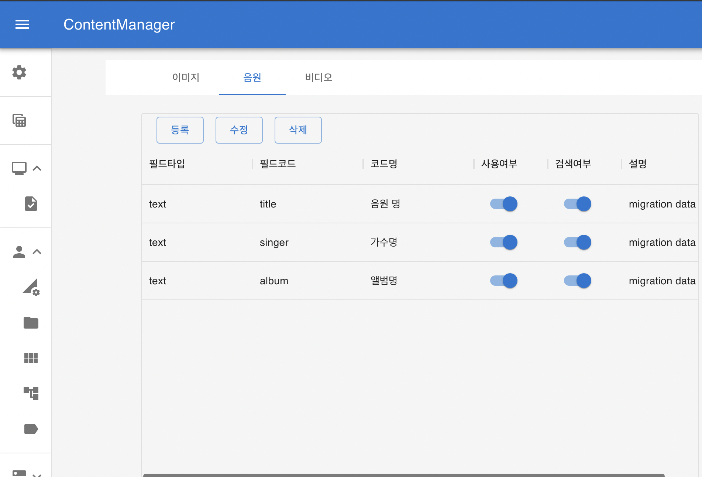
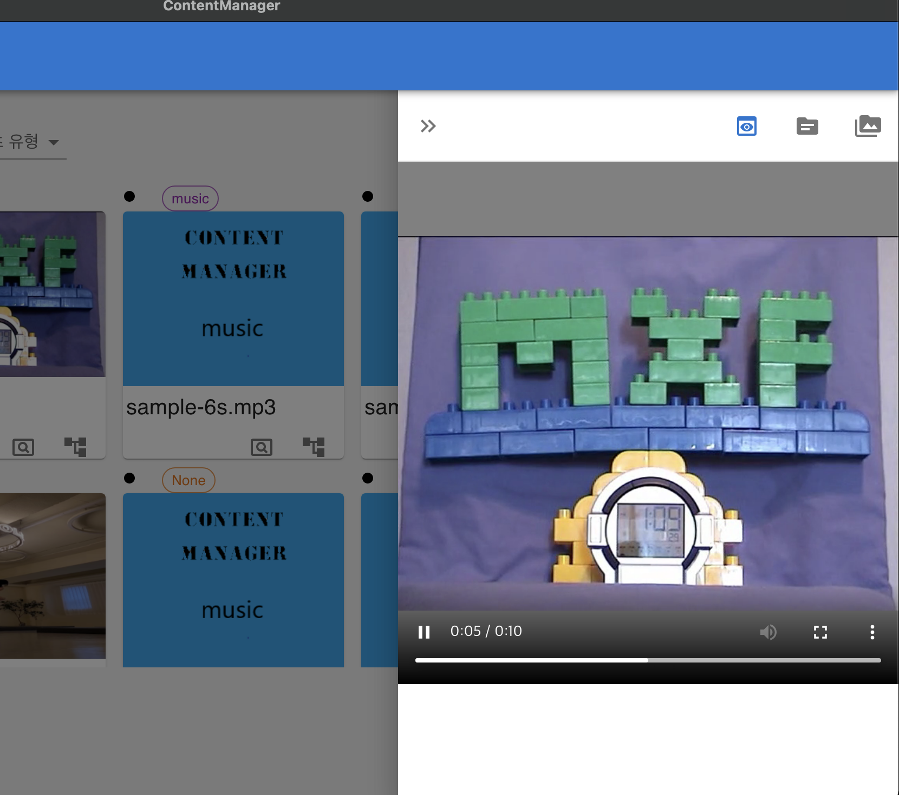
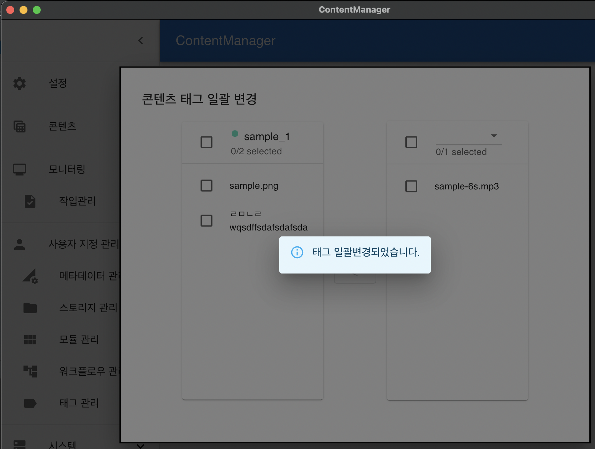
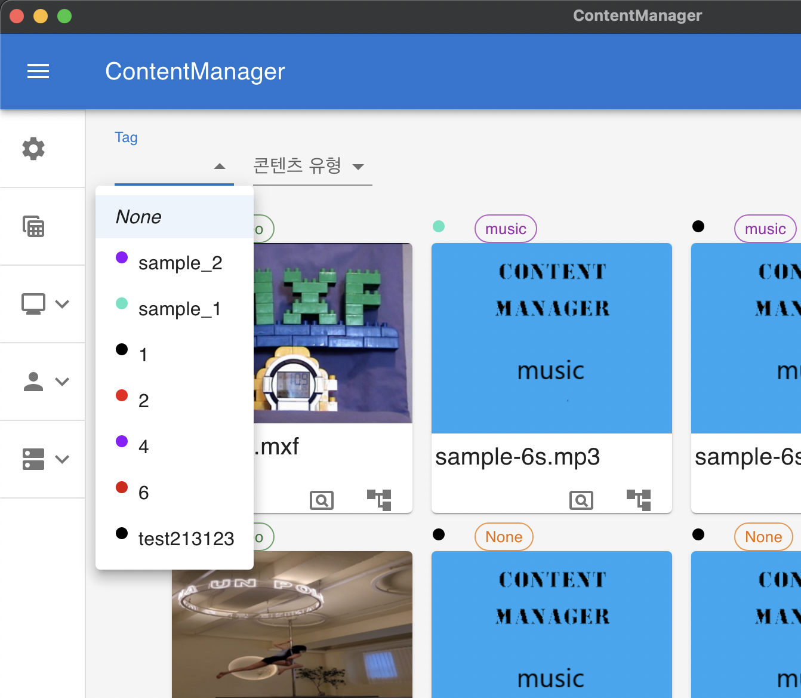
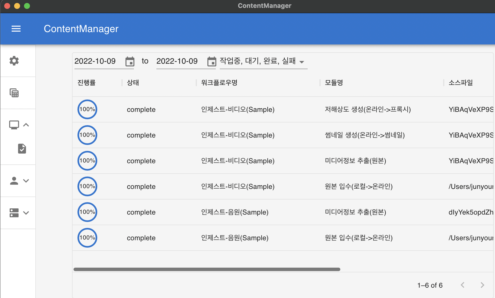
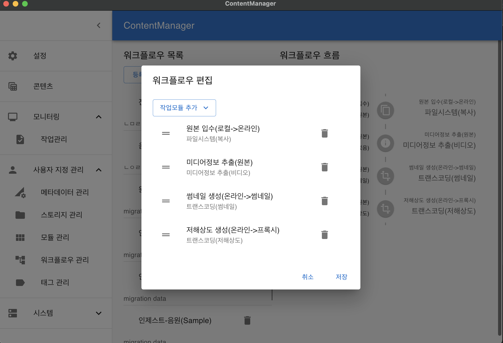
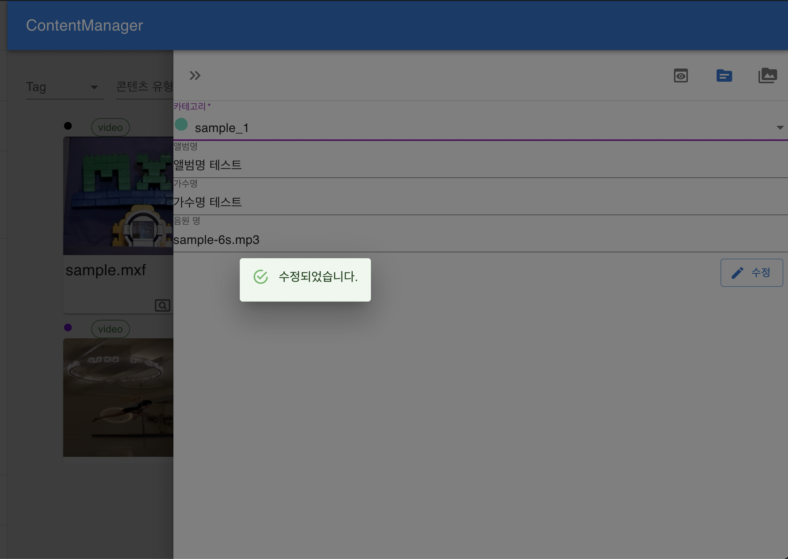
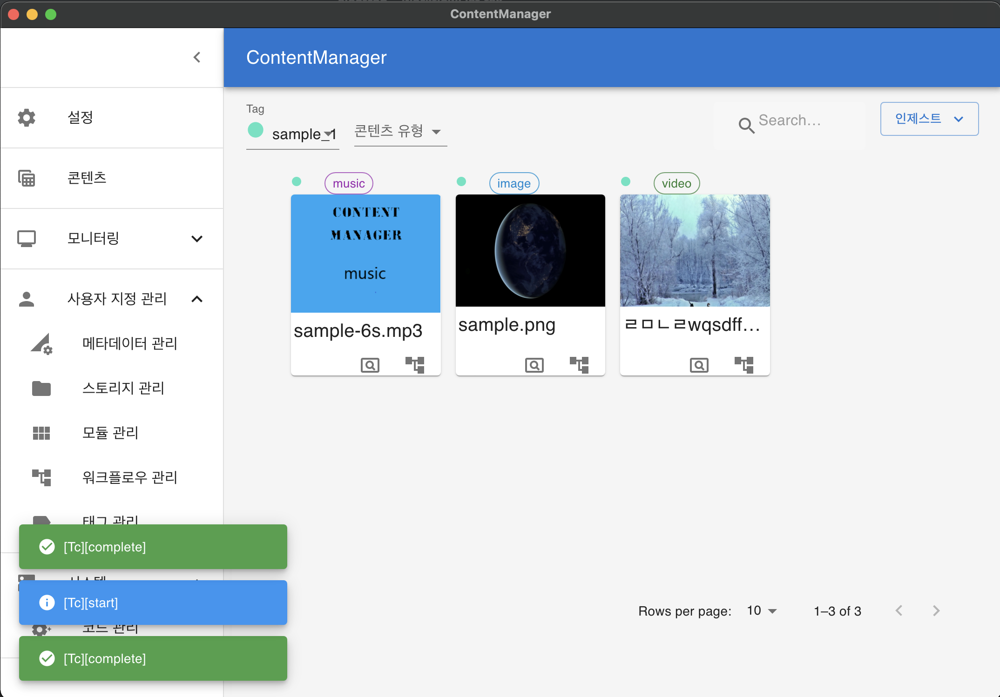

# Content Manager v1.1.9

## Content Manager 다운로드 링크
> <a href="https://github.com/jun-young1993/electron/releases/download/v1.1.10/ContentManager-Setup-1.1.10-x64.exe"><strong>App Download for Windows x64 »</strong></a>  
> <a href="https://github.com/jun-young1993/electron/releases/download/v1.1.9/ContentManager-1.1.9-arm64.dmg"><strong>App Download for mac »</strong></a> 

## 기능
> - 유형별 / 태그별 / 메타데이터별 콘텐츠 검색  
> - 영상 인제스트시 저해상도 / 썸네일 생성  
> - 미디어 다운로드  
> - 사용자 정의 워크플로우/메타데이터 변경
> - Lan 공유 입수

## 스크린샷
||||
|---|---|---|
|  |||
|  |||
|  |||

## 개발 환경
- version
    - node : 14.17.3
    - npm : 6.14.13
    - craco : 5.8
    - electron : 17.2.0
    - typescript : 4.6.3
    - 17.0.2 : 17.0.2

## 실행
- npx create-react-app app --typescript or npx create-react-app app --template typescript
	- 리액트 타입스크립트 
- npm i electron-is-dev
- npm i electron electron-builder concurrently cross-env wait-on typescript --save-dev

		Electron-is-dev: 개발환경인지 빌드한 프로덕션환경인지 확인을 위하여 사용됨.
		Electron : 일렉트론을 실행하기 위해서 사용됨.
		Electron-builder : 일렉트론을 실제 프로덕션 버전으로 빌드하기 위해 사용됨.
		concurrently : 동시에 여러 명령어를 사용(병렬적으로)하기 위해 사용됨.
		cross-env : 프로그램을 CLI환경에서 실행 시킬 때에, OS에 관계 없이 환경변수를 설정할 수 있도록 하기 위해 사용됨.
		wait-on : HTTP 자원, port, file등이 활성화 될 때 까지 기다려주는 cross platform
		typescript : typescript

## 스크립트
- [start] 
	- electron.ts를 js파일로 변환해 준 후, co0ncurrently를 통해 browser로 띄우지 않고 리액트를 실행시킨 후 http://localhost:3000이 로드가 완료되면 electron을 실행시킨다.
- [build] 
	- dist폴더에 production 실행파일을 생성해준다.
- [release]
	- build명령어와 같지만 그 후 배포를 해준다. (추가설정 필요)
	

## npm install
- npm install ffmpeg-static-electron
- npm install fluent-ffmpeg
- npm install ffprobe-static-electron
- npm install electron-log
- npm install react-player
- npm install electron-updater
- npm install react-redux
- npm install @material-ui/core
- npm i react-smooth-dnd
- npm i @material-ui/icons
- npm i array-move
- npm i react-color

## 참고문서
- electorn ffmpeg build pakage.json
	- https://github.com/OpenNewsLabs/autoEdit_2/blob/master/package.json
- video-player example)
	- https://codesandbox.io/s/f2uzv?file=/src/Player.js

